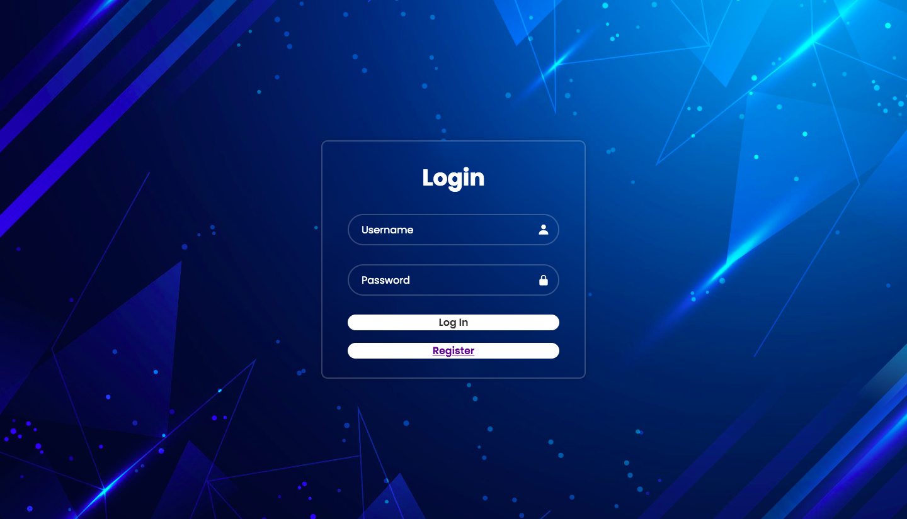
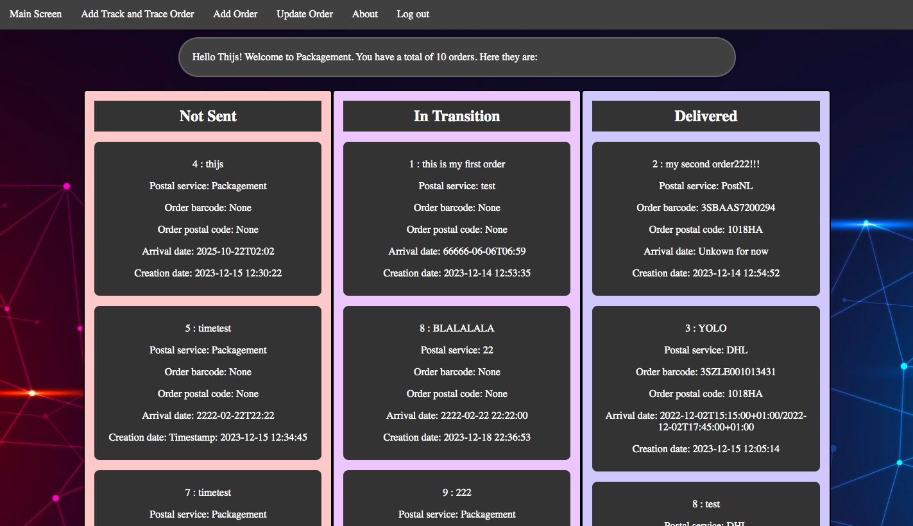
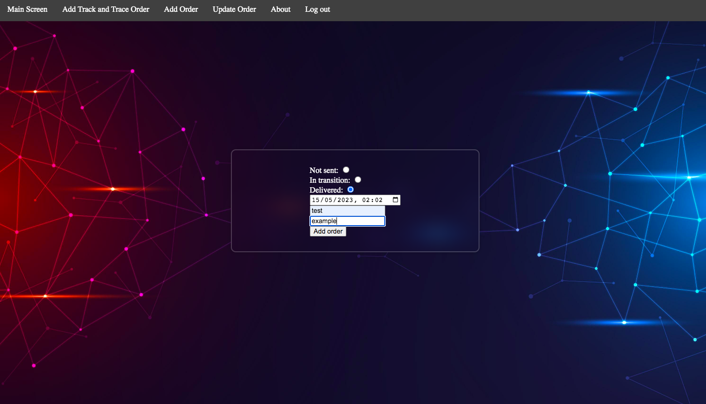

# Packagement
## By Thijs Kooijman
## README project-11896124

Packagement is a flask web application designed to keep track of your personal package orders. By using a Psql database it takes your orders and puts them into a clear overview of their current status. Packagement can add trackandtrace barcodes (Postnl and DHL), which are then loaded into the main overview. You can furthermore add your own custom orders to the lists available. Packagement is meant to be used by people who order a lot on online and want to a clever and easy way to remember if orders have arrived or when orders will arrive.

## Features:

- Login and registration pages.
- Main menu.
- Add Postnl or DHL Track and trace order
- Add personal order
- Delete orders

## Images:

### Login screen:
  

### Main screen:
  

### Adding order:
  

### Video demonstration:
https://youtu.be/kJmVbH1Q-nw

## Installing requirements:

Must have the following installed:
- Flask
- Flask-Session
- Flask-SQLAlchemy
- psycopg2-binary
- SQLAlchemy
- requests
- werkzeug.security
- dateutil

Make sure to also have Python installed!